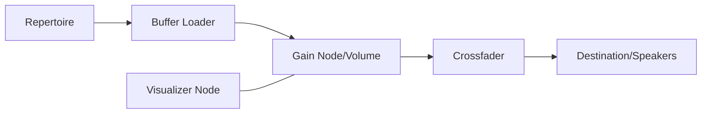

# Architecture Overview — SuniPlayer

**Agente Responsable:** Agent 02 — Audio Systems Architect

---

## 🏗 Stack Tecnológico
- **Frontend:** React + TypeScript + Vite.
- **Estado:** Zustand (Store Centralizado).
- **Estilos:** Vanilla CSS / Design Tokens (Theming dinámico).
- **Audio:** HTML5 Audio Element (Fase 1) $\rightarrow$ Web Audio API (Fase 2).

---

## 📂 Estructura de Capas
1. **Presentation (UI):** Componentes de React en `src/components` y páginas en `src/pages`. Uso de `SuniShell` como orquestador táctico.
2. **Logic (Services):** Servicios puros en `src/services` (SetBuilder, AudioEngine).
3. **State (Store):** Zustand en `src/store`. Es la fuente de verdad única para el UI y el Player.
4. **Data (Metadata):** Constantes y tipos en `src/data` y `src/types`.

---

## 🌊 Flujo de Audio (Propuesto para Fase 2)

---

## 🛠 Decisiones de Arquitectura (ADRs)
- **ADR 001:** Uso de `Zustand` para evitar el overhead de un Context excesivo o la complejidad de Redux.
- **ADR 002:** Arquitectura de "Dos Canales" (implícita): Mientras suena una canción, el sistema debe pre-cargar o al menos preparar los metadatos de la siguiente para evitar latencia de UI.
